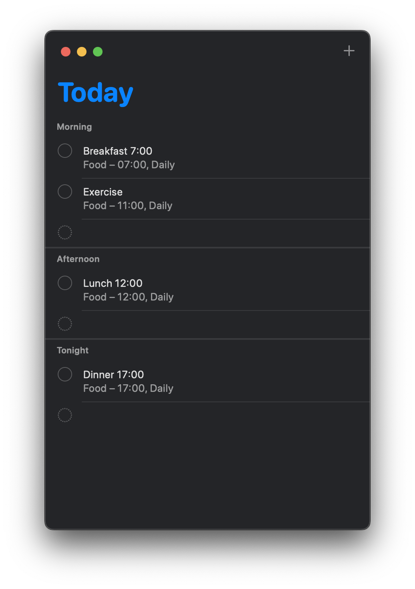

I was five or six years old; it was a sunny day and I was playing at the beach.
My parents wanted to take a photo of me and I remember sucking my stomach in for
that photo. Back then I was already told that I was bigger, heavier and fatter
than other children my age and, because I was a nice and obedient girl, I wanted
to fix that flaw of mine.

One year later my mother was very happy with me when the doctor told her that my
weight was getting better and soon enough I won't be obese anymore, just
overweight! She made a joke how she'd carry me in her arms for the next
appointment.

But that didn't happen, instead, when I started school my weight soared. The
thought that I was flawed had now rooted deeply enough to never leave my mind. I
didn't just occasionally remembered to suck my stomach in; no, I have been
acutely aware of my size and shape at every moment of my existence. And to make
sure I'd never forget I was constantly reminded of it.

## Eating disorders and other ways to be popular

I was put on various diets; back in the day separate eating was all the rage,
thank god keto wasn't a thing yet! I learned to drink tea without sugar,
tolerate supplements, one of which looked and tasted exactly like dirt, but
nothing made a difference! I was getting chubbier by the second and at the age
of twelve I weighed more than 70 kilos.

I looked like a teacher on my school pictures, not only due to my weight, but
also because there wasn't any clothes for children my age and size.

Once, I did lose a whole 5 kilos after a couple of weeks of all-inclusive resort
vacation, which came as a surprise to me! I ate whatever I wanted there after
all! But my underdeveloped frontal lobe couldn't yet comprehend the reasons
behind that and so I brushed it under the rug of miracle and hoped that my lucky
strike would continue.

Except it didn't. As I entered my teenage years and my peers started dating, the
situation got worse. I didn't need to think why: I was told that I wasn't
dateable because whenever I walked by the side of my crush we look like Timon
and Pumba, with me being the latter.

I accepted that. I wasn't yet ready to give up the comfort of food, so I tried
to compensate excess of my body with wits and personality. It kind of worked, as
most of the boys genuinely wanted to hang out with me now, but only as friends.

It did take a tall on my health though: to be a buddy I needed to learn how to
smoke and chug beer like a pro. And yes it did require some effort, specially
with smoking, that crap was disgusting!

At some point I gave in and decided to lose weight no matter what. At the time
my mother was dating a guy that was into starvation cleansing (yeah, I know) and
that inspired me to go on three weeks of not eating anything at all.

I drank mineral water, tea and took long naps after school; smoking also kept my
appetite in check and after three weeks I've lost 18 kilos! Impressive, right?

Well, I gained 5 of them in the following week. The rest came with friends
months later. But the most devastating part was that nothing really changed: I
didn't become girlfriend material even after that torture.

For a long time I didn't have it in me to try another diet. I came up with
another approach though. There was this one thing that was on all the boys'
minds and at that point I was desperate enough to keep an open mind.

I looked much older and I used it to my advantage. I still wasn't dateable, but
I was desired. My first sexual encounter happened when I was fourteen and no,
the man I was with didn't know that.

So as a recap, by the time I graduated school I had a binge-eating disorder, I
was smoking, drinking and had quite of a disordered sexual life.

I did get into a long term relationship couple of years after that with a friend
of mine who was also considered undateable. Mostly because I felt like we
belonged together being the ugly ducklings.

That worked for a while, but I've started to realize that I still was not happy.
And, of course, I've decided that the key to my happiness was to lose weight
once again.

This time I spent months on a diet where I ate 500 kcal a day and meticulously
counted them. Inevitably I've lost weight a lot of weight. I was finally able to
wear any clothes I wanted! I was slim!

And yet, I wasn't happy.

My boyfriend berated me for carrying food boxes everywhere I went, for quitting
drinking and smoking and making him feel bad about himself. Even though he was
proudly showing me off in public, we fought more than ever before.

Eventually, I called it off. I knew that I couldn't possibly stay in this
relationship anymore. And finally, not so long after that, I married a person I
truly liked and got a family I wanted.

## Heavily ever after

My marriage was not the fairy tale I expected, but I couldn't give up so easily,
could I? I worked hard, I spent all my energy and resources on making it less
grim.

By the time I gave birth to my first daughter I was at my heaviest. And the
second pregnancy that came just three months after added even more.

I moved countries, I became really good at my job and I also became morbidly
obese. I tried losing weight every once in a while, but it always came back no
matter what I did.

It took me a while to match my weight gain with level of stress in my life, but
I got there. Now it was finally making sense why I gained weight when I was
bullied at school and when my perfect partner turned out to be something
entirely different.

When we were separating he told me that I'm still beautiful, but I'll have
better chances at finding a new partner if I lose weight. "For the health
reasons, of course", - he added.

But what are those reasons? He was fit, ripped and so very sick, while morbidly
obese me had been just deemed perfectly fine by several doctors.

You see, I never had a problem with high pressure or blood sugar despite of
being told I'd have diabetes just like my grandma, flat feet or that I'd develop
a heart condition!

And yet here I was healthy regardless of everything I went and put myself
through.

## Live it like I'm fit

A friend of mine suggested to try exercising for the sole benefit of the stress
relief. So did my therapist and, as a nice obedient girl that I was, I've
decided to give it a try.

I haven't done sports for fun since I was five, but it felt nice to not worry
about calories and do whatever I felt like doing.

I enjoyed walking and doing home workouts guided by women who looked like me. I
found [@KamoyaFarray](https://www.youtube.com/@KamoyaFarray) the first time I
searched for "plus size workout" and loved it so much that I didn't bothered to
look further, but I'm sure there's a lot more.

Little by little I've started to notice my body for what it was right here and
right now, regardless of anyone else. Slowly I've started to like my reflection
more and more.

For the past months I follow the simplest of routines for eating and exercises:

I don't have a strict food policy. I prefer plant based food, but luckily for me
there's plenty of snacks and fast food that fit into that category. I truly eat
whatever I want. I love unfiltered non-alcoholic bear every once in a while and
a specific brand of chips from a nearby Polish store. Most of my meals are quick
mix of frozen vegetables, rice, soy meat or beans with mustard or ketchup. I
stopped drinking coffee because I never really liked it and, as much as I love
rye bread, I'm avoiding it because it gives me a heartburn.

I've let my diet develop naturally and balance itself like if I wouldn't need to
lose weight.

On average I walk between 3-7km a day, sometimes I skip exercises in favour of a
longer walk, sometimes I do kettlebells, sometimes I go swimming and sometimes I
do nothing. I let my body decide what it needs and wants at the moment. For
being so unhealthy it sure is capable of so many different things!

I am slowly replacing my wardrobe with clothes I really like. Luckily nowadays I
can find almost anything in XL: from bikini and crop tops to waist-fitted
business casual, all of which look really good on my hour-glass figure.

I wouldn't call myself fat, as, according to my scale, more than half of my body
weight is muscle mass, though I wouldn't call myself "muscle" either. I prefer
"curvy", "full figured" or "plus size" over "big", "chubby" and definitely over
"(morbidly) obese", but ultimately I give less and less importance to those
labels.

It took me a long time to accept the fact that my mind was different from what
is considered a norm, it feels logical to try and accept the rest of me as well.

After all, I'm so much happier now when I don't need to lose weight and can
finally let my body naturally take the shape it is supposed to take.

I don't know how much weight I lost or gained anymore, but I like how I look
more and more every day. That newly found confidence goes well with my eyes, I
suppose, and I'll wear it unapologetically.
